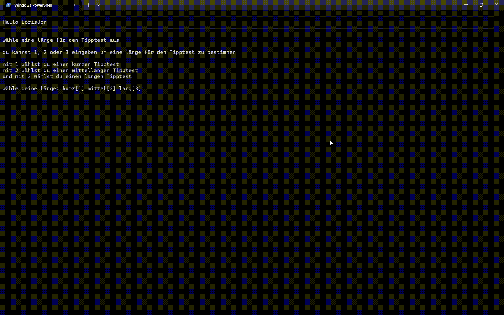
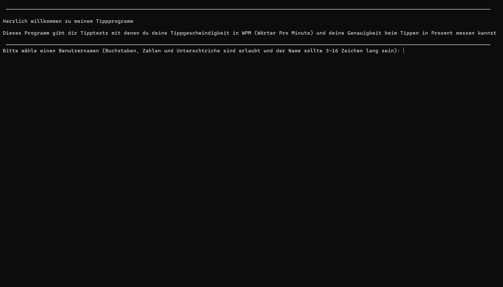
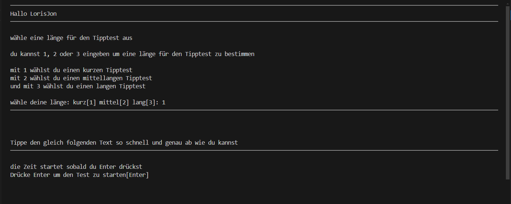
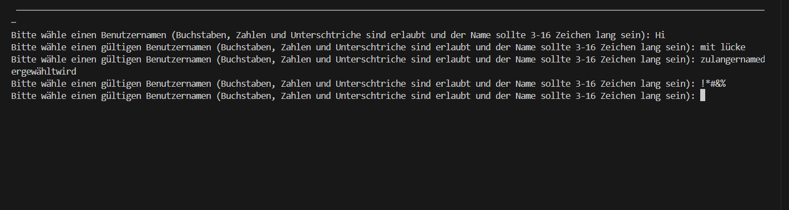
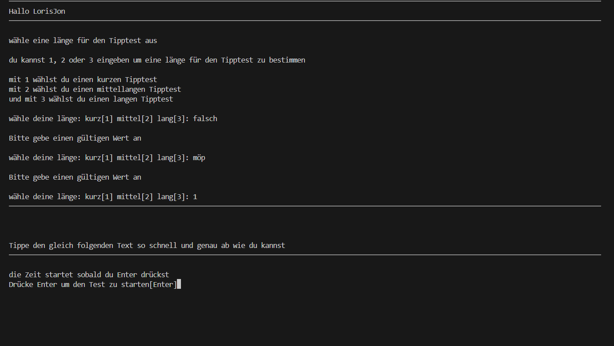

# ⌨️ Python Typing Speed Tester
*Measure your typing speed and accuracy with persistent high scores and averages*


---

## 🎞 Demo

<div align="center">
  
</div>

---

## ⚙️ Key Features

### 👤 User Management
- Create a username once (validated via **Regex**)
- Automatically recognized on subsequent runs  


---

### 📏 Text Length Selection
- Choose between **short**, **medium**, and **long** text samples  


---

### ⌨️ Typing Test
- Take a typing test with **short**, **medium**, or **long** text options
- Measures speed and accuracy in real-time


---

### 📊 Results & Statistics
- Displays:
  - **Typing Speed** in Words Per Minute (WPM)
  - **Accuracy** as a percentage
  - **Highscores** & **Averages** from previous sessions  


---

### 🗄️ Database Persistence
- **SQLite** integration for:
  - User storage
  - Test results (speed & accuracy)
- High scores and averages are automatically calculated  

---

### 🧠 Input Validation
- Username validation (only letters, numbers & underscores; 3–16 chars)
- Text length selection validation (must be 1, 2 or 3)

**Examples:**

<div align="center">
  
  
</div>

---

## 🛠 Technology Stack

- **Python** – Core programming language  
- **Regex** – Input validation  
- **SQLite** – Local database for user and score storage  

---

## 📚 Project Context

> This project was created during my training at **gibb** as part of the *Modul 122 LB2* course.  
>  
> The main goal was to learn **Python programming**, **Regex validation**, and **SQLite database integration**.  
>  
> I previously built a similar program in **PowerShell**, but this Python version adds:
> - Database persistence
> - Regex-based input validation
> - Improved console design  

---

## 🚀 How to Run the Project

```bash
# 1. Clone the repository
git clone https://github.com/yourusername/python-typing-speed-tester.git

# 2. Navigate into the project folder
cd python-typing-speed-tester

# 3. Run the program
python tipptest.py
```

---

## 👤 About the Developer

> I am an aspiring software developer with an interest in **console tools, data persistence, and user experience**.  
>  
> This project helped me strengthen my Python fundamentals and introduced me to SQLite database integration and Regex validation.  
>  
<!-- > 🔗 [View my Portfolio](https://your-portfolio-url.com) -->
